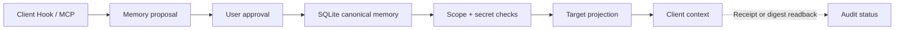

# AI Agent MemoryHub

[简体中文](README.md) | [繁體中文](README.zh-TW.md) | [日本語](README.ja.md) | **English**

**AI Agent MemoryHub** is a local-first, auditable memory synchronization project for AI clients. It treats the Memory Hub as the sole canonical source of truth and supplies Claude Code, Claude Web, and other adapters with authorized, target-specific context projections. It does not misrepresent vendor-internal chat histories or native memories as having been written to.

Current version: `0.1.0`. Public repository:
[`miku233333/aiagent-memoryhub`](https://github.com/miku233333/aiagent-memoryhub).

## Desktop Application

The project includes a cross-platform desktop application built with Electron 40. On launch, the application automatically starts the bundled local Hub, uses the existing React/Vite console, and stores canonical SQLite data in the user's application data directory. Users do not need to start the Python backend and web development server separately.

On first launch, the desktop application generates a permission-restricted local Hub credential in the same user data directory. Electron attaches it only to requests targeting exactly `127.0.0.1:8787`; adapters can read it from this private file, so the token does not need to be copied into project configuration or the interface.

```sh
./script/package_desktop.sh mac
```

The macOS build produces DMG and ZIP packages. On Windows,
`./script/package_desktop.sh win` produces an NSIS installer. The application uses
`electron-updater` to check the fixed GitHub repository for the latest Release. When a newer version is found, the application prompts the user first and does not download or install it without confirmation.

For the complete architecture, signing status, and release checks, see the [desktop application documentation](docs/desktop-app.md).

## Currently Runnable End-to-End Flow



- FastAPI + SQLite Memory Hub: proposals, approvals, retrieval, context packs, forgetting tombstones, and idempotent checkpoints.
- React console: overview, memories, context, connectors, environment diagnostics, Claude account safety, audits, and projection settings.
- Claude Code: four lifecycle Hooks, an incremental JSONL cursor, context injection, and proposal/checkpoint handling.
- Claude Web: a runnable Streamable HTTP REST-to-MCP bridge; real remote connections still require an HTTPS/OAuth gateway.
- Codex: a dependency-free REST CLI and Hook runtime; Qoder and Grok Build reuse this secure runtime.
- ChatGPT Web: a separate remote MCP application template, displayed independently from Codex. It is subject to plan and workspace policy restrictions and cannot claim to write to ChatGPT's native memory.
- OpenClaw and Hermes: plugin/provider scaffolds covered by host-independent contract tests; loading in real hosts has yet to be verified.
- Gemini Spark and Grok Web: remote MCP templates only. The current Hub's `/mcp` endpoint explicitly returns 501, so these integrations cannot be claimed as connected.
- Internationalized wording refinement: generates outbound projections only for Claude/Claude Code, is disabled by default, and never rewrites canonical memory.
- Env Doctor: read-only checks plus a dry-run setup plan; it writes local Claude Code configuration only with an explicit `--apply`.

For other clients' capabilities and current implementation levels, see the [platform capability matrix](docs/platform-capabilities.md).

## Running Locally

Requires Python 3.12+, [`uv`](https://docs.astral.sh/uv/), and Node.js 20+.

If you only want to use the desktop version, run `./script/build_and_run.sh`. To debug the backend and frontend separately, first generate a temporary local token for the current development session. It remains only in the environment variables of the two terminals:

```sh
python3 -c 'import secrets; print(secrets.token_urlsafe(32))'
```

Use the output as `<local-token>`. In terminal one:

```sh
cd backend
uv sync --extra dev
MEMORY_HUB_TOKEN='<local-token>' uv run --no-editable --reinstall-package ai-agent-memory-hub memory-hub
```

In terminal two:

```sh
cd web
corepack pnpm install --frozen-lockfile
MEMORY_HUB_TOKEN='<local-token>' corepack pnpm dev
```

Open `http://127.0.0.1:4173`. Vite proxies `/health` and `/v1` to the default Hub address, `http://127.0.0.1:8787`. If the backend is unavailable, the console clearly displays “Demo data.”

## Environment Diagnostics and Safe Setup

```sh
cd tools/env-doctor

# Read-only checks
python3 -m env_doctor check --project-root ../.. --json

# Explicit network access: perform DNS/TLS checks only for two official Claude domains;
# do not query the public IP address or geolocation
python3 -m env_doctor check --project-root ../.. --probe-network --json

# Generate a change plan only
python3 -m env_doctor setup --project-root ../.. --user-id local-user

# Apply only after review; existing files are backed up before writing
python3 -m env_doctor setup --project-root ../.. --user-id local-user --apply
```

For complete behavior and recovery boundaries, see the [Env Doctor README](tools/env-doctor/README.md).

## Claude Integration

- [Claude Code adapter](adapters/claude-code/README.md): copy/register the plugin Hooks and configure fixed local user/project scopes.
- [Claude Web MCP bridge](adapters/claude-web/README.md): locally verifiable MCP tools. Before connecting a real Claude Custom Connector, you must add public HTTPS, authentication, and deployment-level access controls.

“Hook succeeded” means only that context was injected; “HTTP 2xx” means only that the adapter received the request. The interface may display “Synced” only when the target reads back the same nonce, scope, and digest.

## Verification

```sh
(cd backend && uv run --no-editable pytest -q && uv run --no-editable ruff check . && uv run --no-editable ruff format --check . && uv build)
(cd web && corepack pnpm test && corepack pnpm build)
(cd adapters/claude-code && npm test && npm run check)
(cd adapters/claude-web && npm test && npm run check)
(cd adapters/codex && npm test)
(cd adapters/openclaw && npm test)
(cd adapters/hermes && python3 -m unittest discover -s tests -v)
(cd tools/env-doctor && python3 -m unittest discover -s tests -v)
```

This is a local, single-user PoC. It does not include a multi-tenant identity system, a hosted database, or a built-in remote OAuth gateway, and final UI verification has not been completed with real Claude or ChatGPT accounts. The desktop package generates a local bearer credential and remains loopback-only; standalone development startup must also configure the same bearer for `/v1`. A remote deployment must separately provide authentication, TLS, tenant boundaries, DLP, rate limiting, and revocable delivery receipts.
