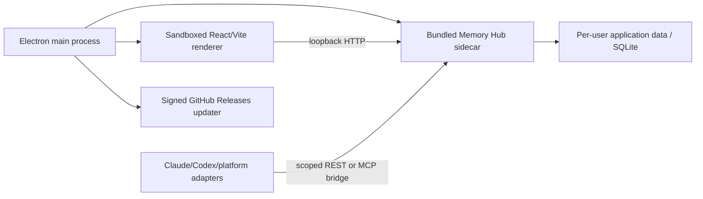

# AI Agent MemoryHub Desktop

The desktop application reuses the existing React control console and FastAPI
Memory Hub. Electron provides the cross-platform application shell while a
PyInstaller sidecar keeps the Python backend self-contained.

## Runtime boundaries



- Electron owns window lifecycle, sidecar startup/shutdown, native dialogs,
  external-link policy, and update state.
- The renderer has `nodeIntegration` disabled, context isolation enabled, and
  receives only a narrow preload bridge.
- The sidecar binds to loopback and serves both the API and packaged web UI.
- Canonical SQLite data lives outside the application bundle, so an update
  does not replace user memory.
- CLI hooks and platform adapters use the same Hub rather than maintaining a
  separate desktop-only memory store.

## Local credential boundary

On first launch, Electron creates a random per-device bearer at
`MemoryHub/hub-token` below the platform application-data directory. On macOS
that is normally `~/Library/Application Support/MemoryHub/hub-token`; on
Windows it is `%APPDATA%\MemoryHub\hub-token`. POSIX files are restricted to
mode `0600` and symlink/non-regular token files are rejected.

The bearer is never exposed through the preload API or renderer state.
Electron replaces any renderer-supplied `Authorization` header and injects the
trusted value only for `/v1` requests to the exact
`http://127.0.0.1:8787` origin. Health and static UI requests remain tokenless.
Adapters prefer an explicit `MEMORY_HUB_TOKEN_FILE`, then a compatible
`MEMORY_HUB_TOKEN`, and finally this private desktop file.

## Build targets

The source is shared across platforms. Native artifacts are built on their own
operating systems:

- macOS: DMG and ZIP through `electron-builder`.
- Windows: NSIS installer through `electron-builder`.

The backend sidecar is produced separately on each runner with Python 3.12 and
PyInstaller. It is never cross-compiled. Release and standalone sidecar builds
use the same committed `backend/packaging/ai-agent-memoryhub-sidecar.spec` and
`backend/packaging/sidecar_entry.py`; there is no second generated release spec.

## Development

```sh
./script/build_and_run.sh
```

The script builds the web console, starts the local backend contract, and
launches Electron through one stable project entrypoint.

## Updates

Packaged builds use `electron-updater` with a fixed GitHub provider:
`miku233333/aiagent-memoryhub`. Startup checks are automatic, downloads are
not. A user must explicitly accept the update before download and installation.

The renderer cannot choose an alternate repository or execute an arbitrary
download URL. Production updates should be signed with a Developer ID
Application identity on macOS and an Authenticode certificate on Windows.

## Signing status

Local macOS builds are ad hoc signed for integrity and development use; local
Windows builds remain unsigned. Public releases require:

- macOS hardened runtime, Developer ID signing, notarization, and stapling.
- Windows Authenticode signing with a stable publisher identity.

The requested Electron `40.10.6` line has a published sandboxed-iframe
`allow-popups` advisory ([GHSA-9f4c-93c8-jc8g](https://github.com/advisories/GHSA-9f4c-93c8-jc8g));
the upstream fix starts at Electron `41.10.3`. This app does not create iframes
or webviews, sets `frame-src 'none'`, and denies every popup/window-open path,
so the reported attack path is not exposed by the current UI. It remains an
upstream residual risk: upgrade and re-test Electron before a public stable
release. `npm audit --omit=dev` currently reports zero runtime dependency
findings, while the full audit retains this one Electron finding.

GitHub Actions receives certificates and credentials only through the protected
`release-signing` Environment. Private values are scoped to the final packaging
step and are stripped from dependency, source-build, and PyInstaller child
processes. No private key, password, Apple ID, or signing token belongs in the
source tree.

## Release checklist

1. Run backend, renderer, adapter, environment doctor, and desktop tests.
2. Verify a packaged proposal-to-context-pack round trip.
3. Confirm the release tag commit is reachable from protected `main`.
4. Inspect every DMG/ZIP app copy for the exact Team ID, and Windows for the
   exact publisher subject and certificate thumbprint.
5. Verify the exact artifact set and updater metadata SHA-512 values.
6. Revalidate source-bound manifests and publish SHA-256 checksums.
7. Verify the update metadata points only to the fixed repository.
8. Test upgrades from the previous release without altering canonical memory.
