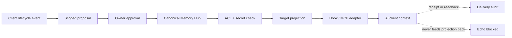

# Platform capability and rollout matrix

Verified against vendor documentation on 2026-08-30. “Automatic” below means Memory Hub can capture or inject approved context without copy/paste. It never means a vendor's private, native memory store was modified.

## Shared architecture

The canonical row is the only durable source of truth. Target projections are disposable, target-scoped, and may not be recommitted as new memory.

## Capability matrix

| Target | Best supported path | Automation ceiling | Current repository status | Important boundary |
| --- | --- | --- | --- | --- |
| Claude Code | `SessionStart` / `UserPromptSubmit` injection plus `Stop` / `SessionEnd` capture | High | Runnable PoC adapter | A successful hook means context was injected, not that Claude's native memory changed. |
| Claude Web / desktop Chat | Public Streamable HTTP MCP connector | Medium | Runnable read-only MCP bridge | The connector is invoked in a conversation; ordinary Chat has no reliable local lifecycle hook. The MCP URL must be publicly reachable for real Claude accounts. |
| Qoder IDE / CLI | Lifecycle hooks and MCP | High | Runnable shared wrapper + hook templates; Qoder host unverified | Hooks can inject/capture turns. A visible config entry still needs runtime verification. |
| Qoder Agent SDK | TypeScript custom memory generation/consumption | High | Contract and roadmap | Custom memory controls are TypeScript-only; Python lacks the same memory option. |
| OpenClaw | Plugin hooks for prompt/turn/session plus MCP registry | High | Contract-tested plugin skeleton; installed host is below declared compatibility floor | Use plugin APIs; do not edit runtime SQLite directly. `openclaw mcp serve` exposes routed conversations, not this Hub's memory automatically. |
| Hermes Agent | Standalone `MemoryProvider` plugin | High | Contract-tested stdlib provider; Hermes host unverified | Provider can `prefetch` and `sync_turn`; ship out-of-tree as a plugin. |
| Gemini Web | Gemini Spark custom app over remote MCP | Low / conditional | Template only; Hub `/mcp` is not installed | Currently limited to eligible US adults with personal accounts, English, Keep Activity on, and Spark; writes require confirmation. |
| Grok Web | Custom public MCP connector | Medium | Template only; Hub `/mcp` is not installed | Grok may select connector tools when relevant; no public API writes Grok's private native memory. |
| Grok Build | Hooks, plugins, MCP, headless JSON / ACP | High | Runnable shared wrapper + hook templates; Grok host unverified | Strong local integration path; its own experimental memory remains separate from canonical Hub memory. |
| Codex | Local REST CLI and hooks | High | Runnable dependency-free REST CLI + hook templates | A hook can inject Hub context but cannot prove a model formed native memory. |
| ChatGPT Web | Custom app over remote MCP | Medium / plan-dependent | Template only; Hub `/mcp` is not installed | Full MCP is currently beta for Business/Enterprise/Edu; Pro is read/fetch only. ChatGPT connects to a remote server, has no deterministic local chat lifecycle hook, and provides no proof of native-memory writes. |

## Evidence links

- Claude Code documents lifecycle hooks including `SessionStart`, `UserPromptSubmit`, `Stop`, and `SessionEnd`: [Claude Code hooks reference](https://code.claude.com/docs/en/hooks).
- Claude custom connectors use remote MCP and originate from Anthropic's cloud, so a localhost-only server is insufficient for Claude Web: [Anthropic custom connector guide](https://support.claude.com/en/articles/11175166-get-started-with-custom-connectors-using-remote-mcp).
- Qoder exposes IDE/CLI lifecycle hooks: [Qoder Hooks](https://docs.qoder.com/qoder/hooks). Its SDK can use application-owned generation and consumption, but the memory controls are TypeScript-only: [Qoder Agent SDK Memory](https://docs.qoder.com/cli/sdk/memory).
- OpenClaw exposes in-process plugin lifecycle hooks: [OpenClaw plugin hooks](https://github.com/openclaw/openclaw/blob/main/docs/plugins/hooks.md). Its `mcp serve` command is a stdio bridge for routed channel conversations: [OpenClaw MCP CLI](https://github.com/openclaw/openclaw/blob/main/docs/cli/mcp.md).
- Hermes memory backends implement a `MemoryProvider` lifecycle and are distributed as standalone plugins: [Hermes Agent contributor contract](https://github.com/NousResearch/hermes-agent/blob/main/AGENTS.md).
- Gemini custom MCP apps are currently a Gemini Spark feature with explicit eligibility and confirmation limits: [Gemini Spark custom apps](https://support.google.com/gemini/answer/17209137).
- Grok supports public custom MCP connectors: [Grok connectors](https://docs.x.ai/grok/connectors). Grok Build supports MCP and Claude-compatible extensions: [Grok Build MCP](https://docs.x.ai/build/features/mcp-servers) and [skills/plugins/hooks](https://docs.x.ai/build/features/skills-plugins-marketplaces).
- ChatGPT supports custom MCP apps through developer mode, subject to plan and
  workspace controls: [OpenAI developer mode and MCP apps](https://help.openai.com/en/articles/12584461-developer-mode-and-full-mcp-connectors-in-chatgpt)
  and [Apps in ChatGPT](https://help.openai.com/en/articles/11487775-connectors-in).

## Meaning of delivery states

| Internal state | User-facing wording | What is actually proven |
| --- | --- | --- |
| `queued` | 等待投递 | Only the Hub outbox contains the job. |
| `accepted_by_adapter` | 上下文已注入 | The local hook or connector accepted the context. |
| `delivered_unverified` | 投递未验证 | A remote endpoint returned, but no target digest was read back. |
| `readback_verified` | 已同步 | The destination returned the expected nonce, scope, and digest. |
| `blocked` | 已阻断 | Secret, scope, authority, or policy validation failed. |
| `tombstoned` | 已遗忘，等待删除回执 | The Hub stopped serving the canonical item and is tracking downstream deletion. |

No UI state says “Claude 已记住” or equivalent because none of these public integration paths proves that a consumer model formed private internal memory.

## Environment doctor boundary

The environment doctor may inspect dependency versions, official endpoints, local Hook/MCP configuration, Hub health, and secret exposure. Setup is dry-run by default, backs up files before an explicit apply, and may use a sandbox to isolate untrusted code or restrict file/network access.

Public network checks are opt-in (`--probe-network`) and limited to DNS plus direct TLS verification for `claude.ai:443` and `api.anthropic.com:443`. They send no HTTP request and return no resolved address, proxy value, certificate body, public-IP reputation, or geolocation.

It must not change timezone, locale, device/browser fingerprints, proxy identity, or other signals to evade regional enforcement or platform risk controls. It also must not automate account farming, access-control bypass, or ban evasion. The referenced FuckClaude repository is used only as inspiration for a local, transparent diagnostic experience; its own README characterizes its signals as reverse-engineering-based and non-official.
